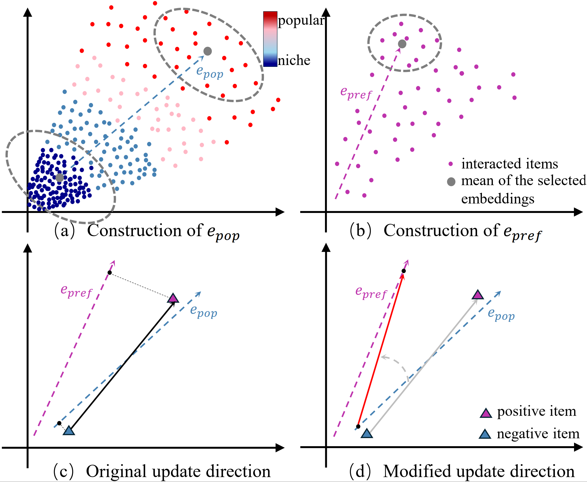

# Rethinking Popularity Bias in Collaborative Filtering via Analytical Vector Decomposition


This repository contains the official source code and experimental data for the paper **"Rethinking Popularity Bias in Collaborative Filtering via Analytical Vector Decomposition"**, which has been accepted by **SIGKDD 2026**.

**Authors:**
Lingfeng Liu¹, Yixin Song¹, Dazhong Shen², Bing Yin³, Hao Li³, Yanyong Zhang¹, Chao Wang¹*

*¹School of Artificial Intelligence and Data Science, University of Science and Technology of China (USTC)*
*²College of Computer Science and Technology, Nanjing University of Aeronautics and Astronautics (NUAA)*
*³iFLYTEK Research*
*(*Corresponding Author)*

---

Our work proposes **<u>D</u>irectional <u>D</u>ecomposition and <u>C</u>orrection (DDC)**, a novel fine-tuning framework to mitigate popularity bias.

## Framework Overview



## Repository Structure

Here is a breakdown of the key files and directories in this project:

```text

ddc/
├── assets/
│   ├── framework.pdf               # Main framework illustration from the paper.
│   └── framework.png               # PNG version of the framework illustration.
├── e_pop_saved/                    # This directory will store the generated e_pop vectors.
│   └── tmall/                      # Pre-calculated e_pop for Tmall.
├── original_result_in_paper/
│   ├── MF/                         # Original training logs for the baseline MF model.
│   └── MF-DDC/                      # Original training logs for our MFDDC model.
├── get_e_pop.ipynb                 # Jupyter notebook to extract the e_pop vector.
├── mf.py                           # Script to train the baseline MF model.
├── mfddc.py                        # Script to finetune the MF model with our DDC method.
├── lightgcn.py                     # Script to train the baseline LightGCN model.
└── lightgcnddc.py                  # Script to finetune the LightGCN model with our DDC method.

```

- **`assets/`**: Contains visual assets used in the paper.
- **`e_pop_saved/`**: This directory is intended to store the generated popularity direction vectors (`e_pop`) generated by `get_e_pop.ipynb`. To facilitate reproduction, we have included a pre-calculated `e_pop` vector for the **Tmall** dataset.
- **`original_result_in_paper/`**: Contains the raw training logs for both the baseline and our proposed DDC models across all three datasets, serving as proof of our reported results.
- **`get_e_pop.ipynb`**: A notebook to compute and extract the `e_pop` vector from a trained model's item embeddings.
- **`mf.py` / `lightgcn.py`**: The scripts for training the baseline models (MF and LightGCN).
- **`mfddc.py` / `lightgcnddc.py`**: The main scripts for fine-tuning pre-trained models with our proposed DDC method.

## Acknowledgement for RecBole

This project is implemented based on the open-source recommendation library **[RecBole](https://github.com/RUCAIBox/RecBole)**. We highly appreciate their contribution to the community.

## Installation

You can set up the required environment using Conda.

1. **Create and activate a new Conda environment:**

    ```bash
    conda create --name ddc python==3.9
    conda activate ddc
    ```

2. **Install the necessary packages:**

    ```bash
    pip install recbole==1.2.1
    pip install torch==2.1.0
    pip install numpy==1.26.0
    pip install pandas==2.2.2
    ```

## How to Reproduce Results

To reproduce the results from our paper, please follow these three sequential steps. We use the **Tmall** dataset as the primary example.

### Step 1: Train the Base Model

First, train the base model (MF or LightGCN). This script will generate the necessary pre-trained model checkpoint (`.pth` file). The `--dataset_id` argument specifies the dataset (0: Amazon, 1: Yelp, 2: Tmall).

```bash
# Example for Tmall dataset using MF
python mf.py -g 0 -d 2

# Example for Tmall dataset using LightGCN
python lightgcn.py -g 0 -d 2
```

This will train the model and save a checkpoint file inside the `./saved/` directory. **Take note of the full path to this new `.pth` file**, as it is required for subsequent steps.

### Step 2: Extract the Popularity Direction (`e_pop`)

Next, extract the popularity direction from the item embeddings of the trained model.

> **Note for Tmall dataset:** To simplify the process, we provide a pre-calculated `e_pop` vector at `./e_pop_saved/tmall/rep_direction_item_tmall_20250802_203218.json`. If you are using the Tmall dataset, you may **skip this step** and use the provided file path directly in Step 3.

If you wish to generate the vector for other datasets or from your own trained model:

1.  Open the Jupyter Notebook `get_e_pop.ipynb`.

2.  Locate the cell containing the `MODEL_FILE` variable:

    ```python
    # ddc/get_e_pop.ipynb

    MODEL_FILE = './saved/path_to_your_tmall_model.pth'
    ```

3.  **Update this variable** with the path to the checkpoint file generated in Step 1.

4.  Execute all cells in the notebook. This will generate a new `.json` file containing the `e_pop` vector in the corresponding dataset folder inside `./e_pop_saved/` (e.g., `./e_pop_saved/tmall/`). **Take note of the path to this new `.json` file.**

### Step 3: Fine-tune with DDC

Finally, fine-tune the model using the artifacts from the previous steps.

1.  Open the script `mfddc.py` (or `lightgcnddc.py`).

2.  Locate and **update the `DEFAULT_MODEL_FILE` and `DEFAULT_REP_DIRECTION_FILE` lists** with the full paths to the `.pth` and `.json` files.

    ```python
    # ddc/mfddc.py or ddc/lightgcnddc.py

    # Example for Tmall (index 2)
    DEFAULT_MODEL_FILE = [
        './saved/path_to_your_amazon_model.pth',      # amazon
        './saved/path_to_your_yelp_model.pth',        # yelp
        './saved/path_from_step_1.pth',               # tmall (UPDATE THIS)
    ]
    DEFAULT_REP_DIRECTION_FILE = [
        './e_pop_saved/amazon/your_amazon_direction.json', # amazon
        './e_pop_saved/yelp/your_yelp_direction.json',     # yelp
        './e_pop_saved/tmall/path_from_step_2.json',       # tmall (UPDATE THIS, or use the pre-calculated one)
    ]
    ```

3.  Run the script with the desired hyperparameters.

    ```bash
    # Example for Tmall dataset
    python mfddc.py --gpu_id 0 --use_epre --epre_sort_mode 'y_uio' --epre_select_mode 'top' --epre_agg_mode 'mean' --epre_topk 0.3 --loss_combination 'b_a' --dataset_index 2
    ```

    This command initiates the fine-tuning process, which will reproduce the results reported in our paper.

## Reproducibility Statement

Our work places a strong emphasis on reproducibility. The random seeds for all components (numpy, torch, and data splitting) have been fixed. Following the steps outlined above will produce results that are **identical** to those reported in our paper. The original training logs are also provided in the `original_result_in_paper/` directory for verification.

## Acknowledgement

This work was supported in part by the National Natural Science Foundation of China (Grant No. 62506348), the Natural Science Foundation of Anhui Province (Grant No. 2508085QF211), the CCF-1688 Yuanbao Cooperation Fund (Grant No. CCF-Alibaba2025005), China Postdoctoral Science Foundation (No. GZC20252740) and National Natural Science Foundation of China (No. 62406141).

## Citation

If you find this work helpful to your research, please kindly consider citing our paper.

```bibtex
@inproceedings{liu2026rethinking,
  title={Rethinking Popularity Bias in Collaborative Filtering via Analytical Vector Decomposition},
  author={Liu, Lingfeng and Song, Yixin and Shen, Dazhong and Yin, Bing and Li, Hao and Zhang, Yanyong and Wang, Chao},
  booktitle={32nd SIGKDD Conference on Knowledge Discovery and Data Mining, 2026 - Research Track},
  year={2026},
  url={[https://openreview.net/forum?id=qV95G1UA9S](https://openreview.net/forum?id=qV95G1UA9S)}
}
```
